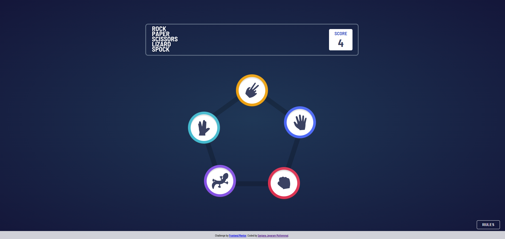
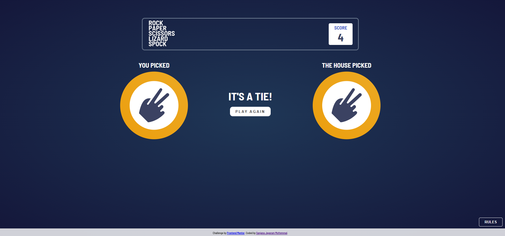
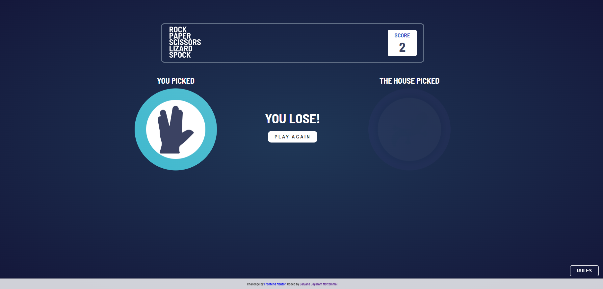
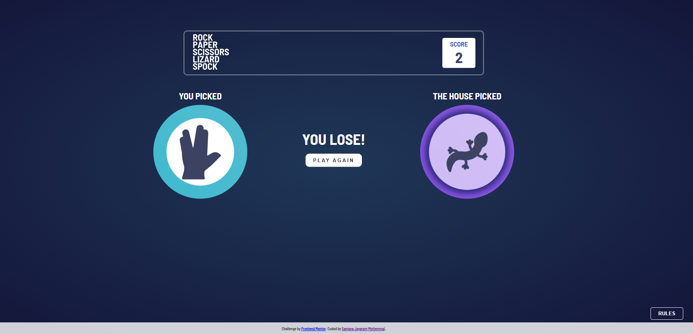
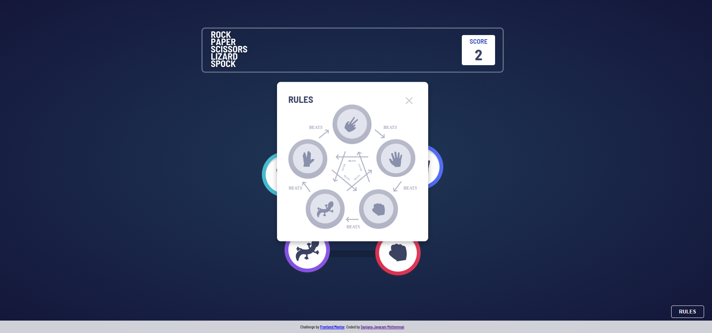
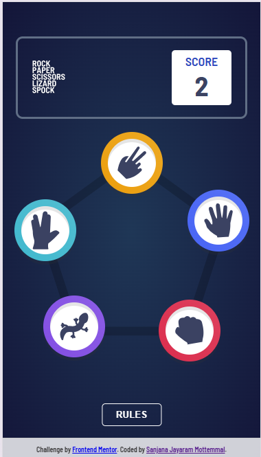
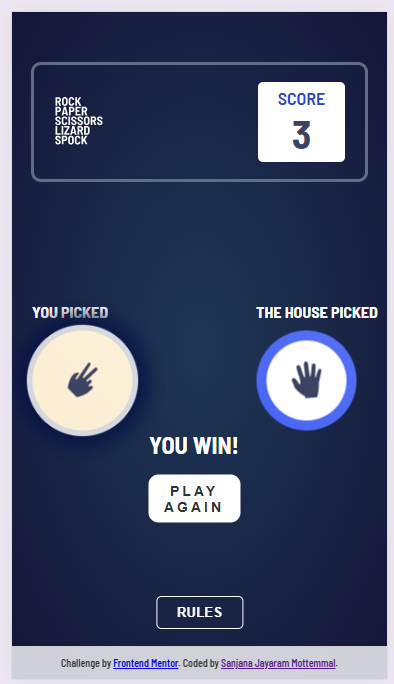
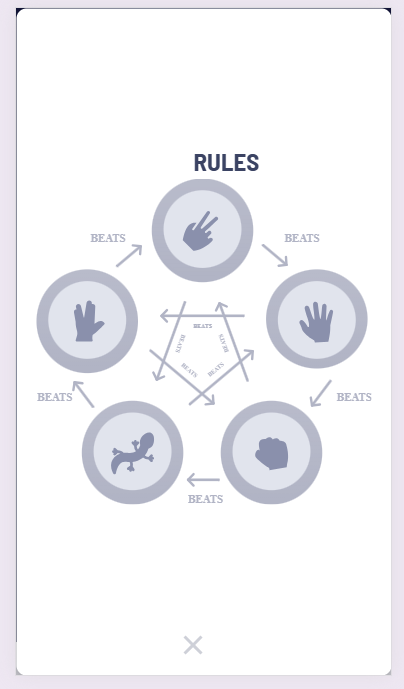
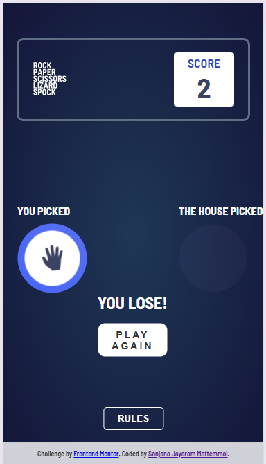

# Frontend-Mentor---Rock-Paper-Scissors-Solution

This is a solution to the [Rock, Paper, Scissors challenge on Frontend Mentor](https://www.frontendmentor.io/challenges/rock-paper-scissors-game-pTgwgvgH). Frontend Mentor challenges help you improve your coding skills by building realistic projects. 

## Table of contents

- [Overview](#overview)
  - [The challenge](#the-challenge)
  - [Screenshot](#screenshot)
  - [Links](#links)
- [My process](#my-process)
  - [Built with](#built-with)
  - [What I learned](#what-i-learned)
  - [Continued development](#continued-development)
  - [Useful resources](#useful-resources)
- [Author](#author)
- [Acknowledgments](#acknowledgments)

**Note: Delete this note and update the table of contents based on what sections you keep.**

## Overview

### The challenge

Users should be able to:

- View the optimal layout for the game depending on their device's screen size
- Play Rock, Paper, Scissors against the computer
- Maintain the state of the score after refreshing the browser 
- Play Rock, Paper, Scissors, Lizard, Spock against the computer 

## Screenshots

These are the screenshots of the Rock, Paper, Scissors game, showcasing both mobile and desktop responsive designs:

### Links

- Solution URL: [GitHub Repository](https://github.com/SanjanaJayaramM93/Frontend-Mentor---Rock-Paper-Scissors-Solution.git)
- Live Site URL: [Add live site URL here](https://your-live-site-url.com)

## My process

### Built with

- Semantic HTML5 markup
- JavaScript
- SCSS (Sass)
- Flexbox
- Mobile-first workflow

### What I learned

- **Responsive Design**: I learned how to create a responsive layout using Flexbox and media queries to ensure that the game looks good on both mobile and desktop devices. This involved adjusting styles and elements based on screen size.

- **State Management**: I implemented state management to keep track of the score and game status, which taught me how to handle dynamic data in a JavaScript application.

- **Game Logic**: I gained a deeper understanding of how to implement game logic, including the rules of Rock, Paper, Scissors, and the additional Lizard and Spock rules. This helped me practice conditional statements and event handling in JavaScript.

- **SCSS (Sass) Features**: I utilized SCSS to manage my styles more efficiently, taking advantage of features like variables, nesting, and mixins, which made my stylesheets cleaner and easier to maintain.

- **User Experience**: I focused on creating an engaging user experience by providing visual feedback (such as winning/losing animations) and ensuring that the game was easy to understand and play.

- **Debugging and Problem-Solving**: Throughout the development process, I encountered and resolved various challenges, which improved my debugging skills and problem-solving abilities in web development.

## Author

- Website: [Sanjana Jayaram](https://sanjanajayaramm.netlify.app/)
- Frontend Mentor: [@SanjanaJayaramM93](https://www.frontendmentor.io/profile/SanjanaJayaramM93)
- LinkedIn: [Sanjana Jayaram](https://www.linkedin.com/in/sanjana-jayaram-mottemmal-435133235/)

